# Myšlienková mapa: Trojmesačný akčný plán 3ve plus s.r.o.

**Začiatok plánu:** 12. január 2026

```mermaid
graph TD
    A[Trojmesačný akčný plán 3ve plus s.r.o.] --> B(Mesiac 1: Nastavenie a Baseline - Január 2026)
    A --> C(Mesiac 2: Exekúcia a Optimalizácia - Február 2026)
    A --> D(Mesiac 3: Revízia a Plánovanie - Marec 2026)

    B --> B1[PSF - Vy: Stratégia a Financie]
    B --> B2[POL - Zdeno: Prevádzka a Logistika]
    B --> B3[PHR/BD - David: Ľudské zdroje a Rozvoj]
    B --> B4[Kontrolné body Mesiaca 1]

    B1 --> B1_1(12.1. - 16.1.: Zber finančných dát & Baseline)
    B1_1 --> B1_1_1{Očakávaný výsledok: Presné východiskové hodnoty Ziskovej marže a DSO}

    B1 --> B1_2(19.1. - 23.1.: Analýza procesov & Výber systému & Príprava implementácie)
    B1_2 --> B1_2_1{Očakávaný výsledok: Identifikované slabé miesta. Systém pripravený na spustenie.}

    B1 --> B1_3(26.1. - 30.1.: Spustenie systému & Školenie & Monitorovanie)
    B1_3 --> B1_3_1{Očakávaný výsledok: Nový systém v prevádzke. Kľúčoví používatelia zaškolení.}

    B2 --> B2_1(12.1. - 16.1.: Zber prevádzkových dát & Baseline & Reklamácie)
    B2_1 --> B2_1_1{Očakávaný výsledok: Presné východiskové hodnoty logistických nákladov a miery reklamácií.}

    B2 --> B2_2(19.1. - 23.1.: Analýza trás & Návrh optimalizácie & Príprava systému dochádzky)
    B2_2 --> B2_2_1{Očakávaný výsledok: Návrhy na optimalizáciu logistiky. Systém dochádzky pripravený.}

    B2 --> B2_3(26.1. - 30.1.: Spustenie sledovania dochádzky & Komunikácia & Nápravné opatrenia)
    B2_3 --> B2_3_1{Očakávaný výsledok: Sledovanie dochádzky aktívne. Zamestnanci informovaní. Prvé analýzy reklamácií.}

    B3 --> B3_1(12.1. - 16.1.: Zber dát o fluktuácii & Baseline & Identifikácia potenciálu)
    B3_1 --> B3_1_1{Očakávaný výsledok: Presná východisková miera fluktuácie. Zoznam potenciálnych klientov.}

    B3 --> B3_2(19.1. - 23.1.: Analýza dochádzkovej agendy & Výber nástroja & Príprava podkladov pre ponuky)
    B3_2 --> B3_2_1{Očakávaný výsledok: Vybraný nástroj na automatizáciu. Zozbierané podklady pre ponuky.}

    B3 --> B3_3(26.1. - 30.1.: Spustenie automatizácie & Príprava ponúk & Návrh opatrení proti fluktuácii)
    B3_3 --> B3_3_1{Očakávaný výsledok: Automatizácia dochádzky v prevádzke. Drafty ponúk hotové. Návrhy na zníženie fluktuácie.}

    B4 --> B4_1(Týždenné stretnutia: Každý piatok)
    B4_1 --> B4_1_1{Zameranie: Pokrok KR, prekážky, koordinácia úloh.}

    B4 --> B4_2(Koniec mesiaca: 30.1.2026 - Spoločná revízia)
    B4_2 --> B4_2_1{Zameranie: Vyhodnotenie Mesiaca 1, potvrdenie baseline, príprava na Mesiac 2.}
```

## Vysvetlenie štruktúry myšlienkovej mapy:

*   **Hlavný uzol:** `Trojmesačný akčný plán 3ve plus s.r.o.`
*   **Hlavné vetvy:** `Mesiac 1`, `Mesiac 2`, `Mesiac 3` (súčasťou je aj dátumový rozsah).
*   **Podvetvy Mesiaca 1:** Rozdelené podľa prokuristov (`PSF - Vy`, `POL - Zdeno`, `PHR/BD - David`) a `Kontrolné body Mesiaca 1`.
*   **Detailné úlohy:** Pod každým prokuristom sú uvedené konkrétne úlohy s dátumovým rozsahom a zjednodušeným popisom.
*   **Očakávaný výsledok:** Pre každú úlohu je uvedený stručný očakávaný výsledok.
*   **Kontrolné body:** Obsahujú detaily o týždenných stretnutiach a mesačnej revízii.

Tento zjednodušený formát by mal byť kompatibilný s Mermaid renderovaním na GitHub-e. Pre detailné informácie, dopisovateľné polia a presné dátumy splnenia úloh prosím použite DOCX súbor, ktorý som vám už predtým poskytol.
